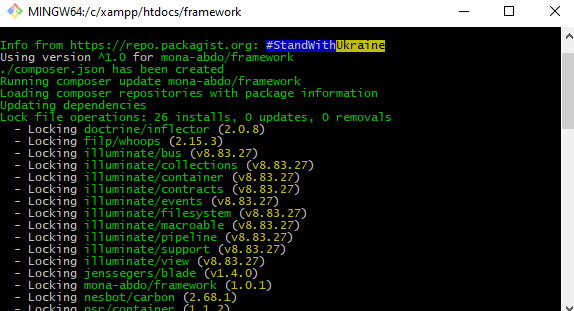

# Framework
Simple PHP Framework
# Requirements

<table>
    <tr>
        <th>php</th>
        <th>filp/whoops</th>
        <th>jenssegers/blade</th>
        <th>rakit/validation</th>
    </tr>
    <tr>
        <td>^8.1.3</td>
        <td>^2.15</td>
        <td>^1.4</td>
        <td>^1.4</td>
    </tr>
</table>

# Install
<pre>composer require mona-abdo/framework</pre>

